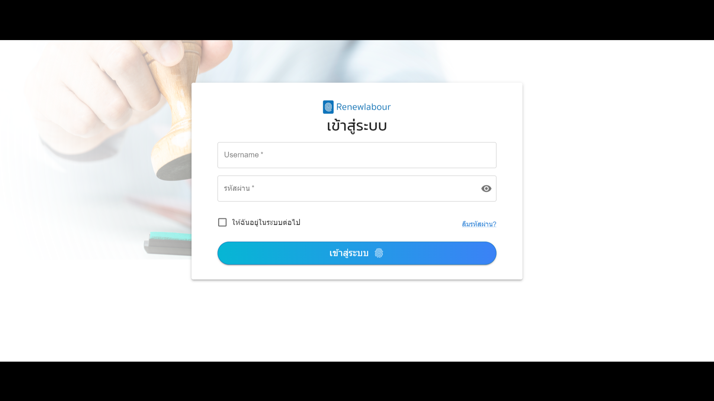
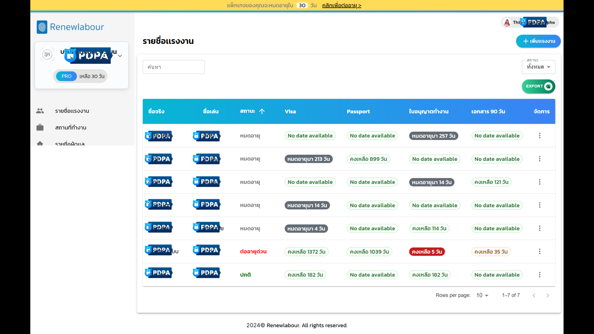
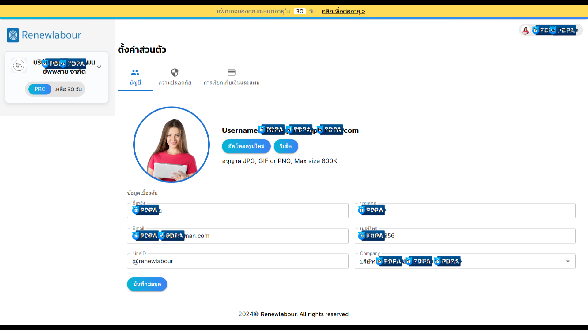
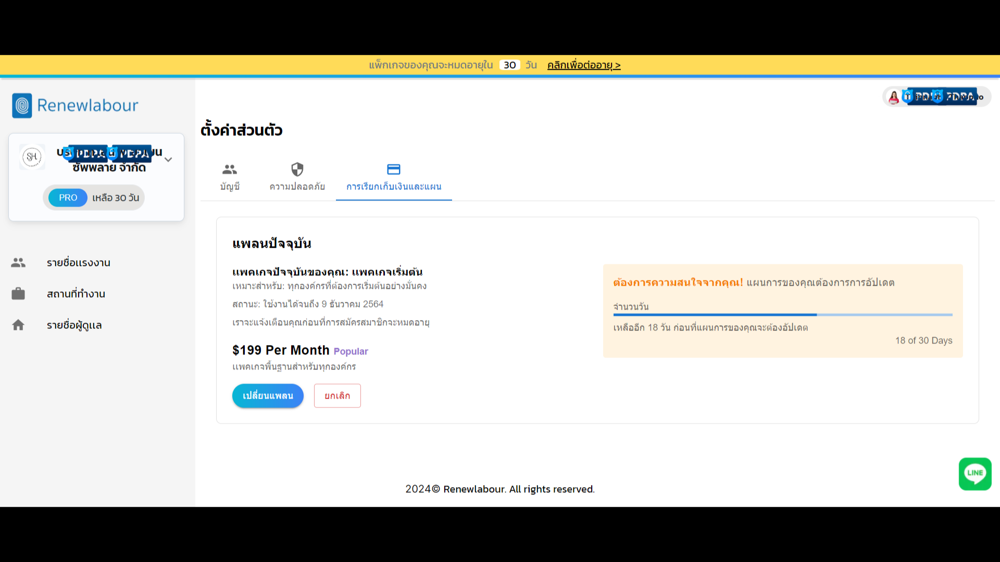
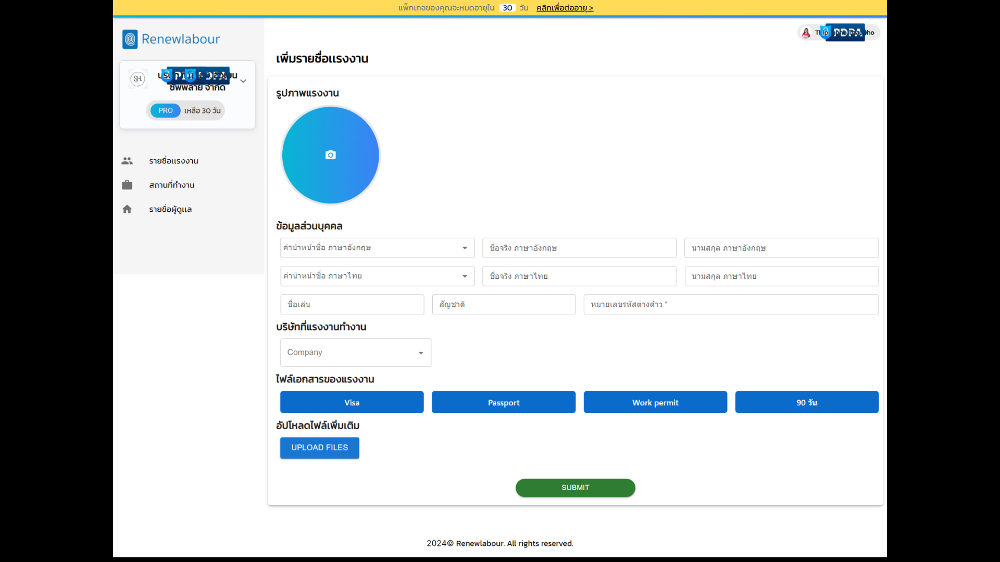
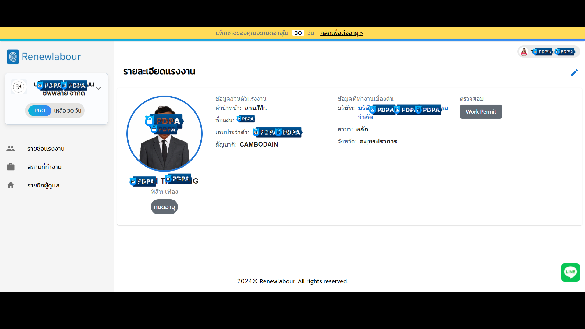

### Renewlabour
---

**Employee Management Application**

This project is an Employee Management Application built with React and Material UI (MUI). The app provides a responsive interface for managing employee data, including the status of their work documents (Visa, Passport, Work Permit, 90-Day Report). Users can filter, search, sort, and export the data, making the management process efficient and user-friendly.

### **Features**
- **Responsive Design**: The app is designed to adjust seamlessly across different screen sizes, ensuring usability on mobile and desktop devices.
- **Employee List Display**: Displays a table of employee details, including their real names, nicknames, and the status of their key documents (Visa, Passport, Work Permit, and 90-Day Reports).
- **Document Status Calculation**: Automatically calculates the remaining validity of each employee’s documents and categorizes their status:
  - **Expired (หมดอายุ)**: The document is no longer valid.
  - **Urgent Renewal (ต่ออายุด่วน)**: The document will expire within 31 days.
  - **About to Expire (ใกล้หมดอายุ)**: The document will expire within 31–61 days.
  - **Normal (ปกติ)**: The document is valid for more than 61 days.
- **Data Filtering**: Filter employees by their document status. Available statuses include:
  - All (ทั้งหมด)
  - Urgent Renewal (ต่ออายุด่วน)
  - About to Expire (ใกล้หมดอายุ)
  - Expired (หมดอายุ)
  - Normal (ปกติ)
- **Search Functionality**: Users can search for employees by their real names or nicknames.
- **Sorting**: The list of employees can be sorted based on document expiration dates, with an option to toggle between ascending and descending order.
- **Pagination**: Supports pagination for easy navigation through large employee datasets.
- **Export Functionality**: Provides an option to export filtered employee data to Excel format for offline access or reporting.
- **Loading Indicator**: Displays a loading spinner while fetching data from the API.

### **Components Used**
- **Material UI Components**: Includes Table, TableCell, TableHead, TableBody, Button, Typography, IconButton, Menu, TextField, TablePagination, and more for building the UI.
- **Icons**: Uses MUI icons like AddIcon, ArrowUpward, ArrowDownward, and MoreVertIcon for user actions such as sorting and adding data.
- **Moment.js**: Used for managing and formatting date-related operations, such as calculating document expiration times.
- **Axios**: For making API requests to fetch employee data.

### **Project Structure**
- **EmployeeTable**: Displays the list of employees along with their document status and actions.
- **Loading Indicator**: Displays a loading spinner when employee data is being fetched from the API.
- **Export Functionality**: Provides an Excel export button to download the currently displayed employee data.
- **Dynamic Sorting**: Allows users to sort the employee list by the expiration dates of their documents.
- **Search & Filter**: Includes text fields and dropdown filters to refine the list of employees based on search queries or document statuses.

### **API Integration**
The application integrates with a backend API using Axios to fetch employee data, including:
- Employee name and nickname
- Status of documents (Visa, Passport, Work Permit, 90-Day Report)
- Expiration dates of each document

### **Usage**
- **Search Employees**: Search for employees by their real names or nicknames.
- **Filter by Status**: Filter employees by document status using the dropdown menu.
- **Sort Data**: Click on the sort icon to arrange employees by the expiration dates of their documents, either in ascending or descending order.
- **Export Data**: Export the currently filtered list of employees as an Excel file.
- **Pagination**: Navigate through different pages of employee data using pagination controls.

# Some of UI 






<hr>

This is a [Next.js](https://nextjs.org/) project bootstrapped with [`create-next-app`](https://github.com/vercel/next.js/tree/canary/packages/create-next-app).

## Getting Started

First, run the development server:

```bash
npm run dev
# or
yarn dev
# or
pnpm dev
# or
bun dev
```

Open [http://localhost:3000](http://localhost:3000) with your browser to see the result.

You can start editing the page by modifying `app/page.tsx`. The page auto-updates as you edit the file.

This project uses [`next/font`](https://nextjs.org/docs/basic-features/font-optimization) to automatically optimize and load Inter, a custom Google Font.

## Learn More

To learn more about Next.js, take a look at the following resources:

- [Next.js Documentation](https://nextjs.org/docs) - learn about Next.js features and API.
- [Learn Next.js](https://nextjs.org/learn) - an interactive Next.js tutorial.

You can check out [the Next.js GitHub repository](https://github.com/vercel/next.js/) - your feedback and contributions are welcome!

## Deploy on Vercel

The easiest way to deploy your Next.js app is to use the [Vercel Platform](https://vercel.com/new?utm_medium=default-template&filter=next.js&utm_source=create-next-app&utm_campaign=create-next-app-readme) from the creators of Next.js.

Check out our [Next.js deployment documentation](https://nextjs.org/docs/deployment) for more details.
